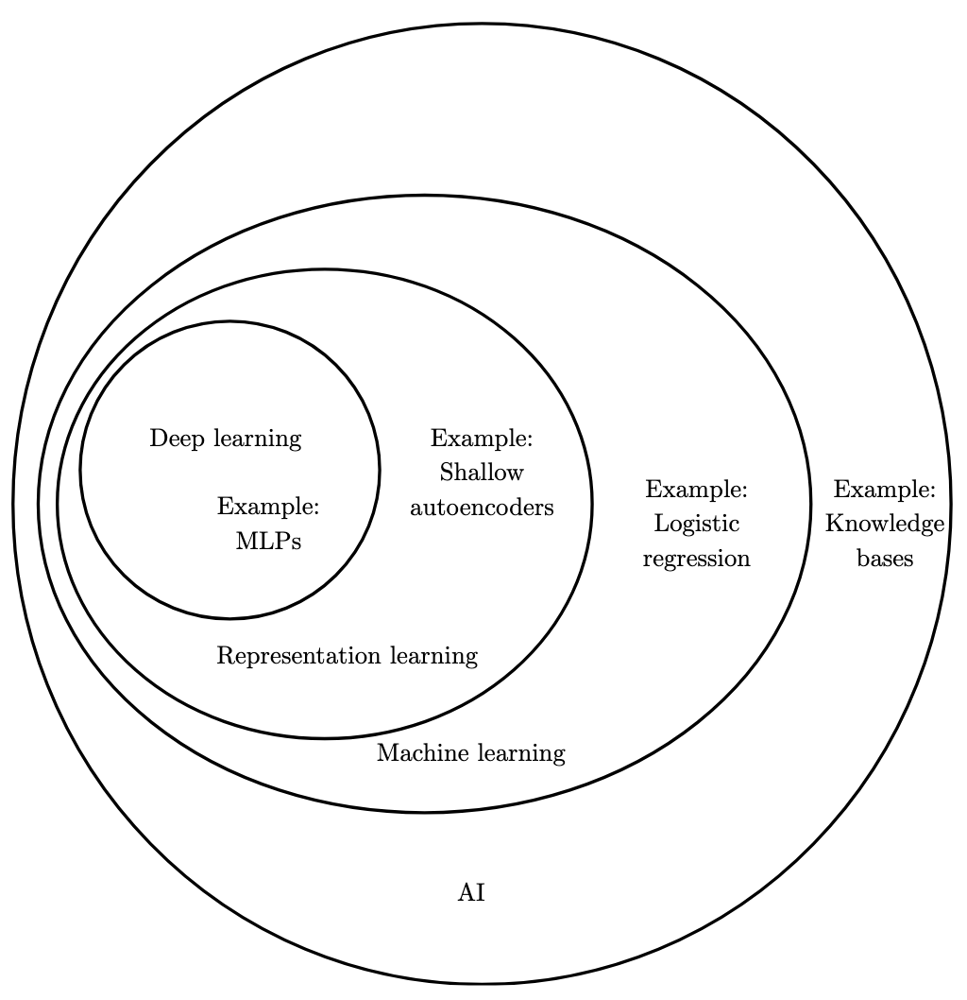
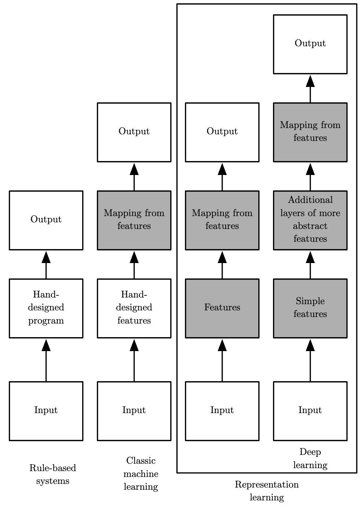
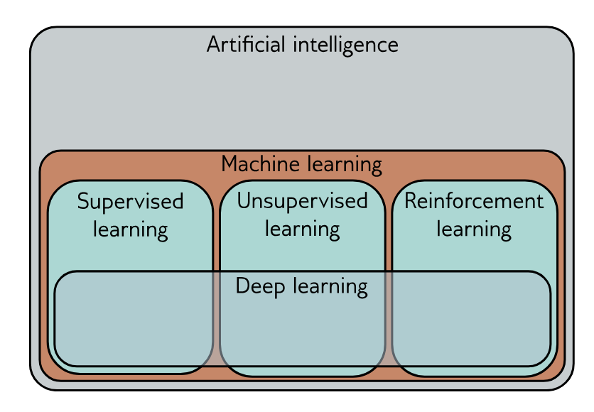

# AI Landscape

AI是一个宏大的领域，我们需要一张地图。

## 什么是AI

什么是智能，什么是人工的智能？很难下定义。

《AIMA》总结了4种实现人工智能的路线，可以看作4种务实的定义。

1. Acting humanly: The Turing test approach
2. Thinking humanly: The cognitive modeling approach
3. Thinking rationally: The “laws of thought” approach
4. Acting rationally: The rational agent approach

图灵测试最容易被普通人所理解。为了通过图灵测试（The Turing test approach），The computer would need the following capabilities:

* natural language processing to communicate successfully in a human language;（自然语言处理）
* knowledge representation to store what it knows or hears;（知识表示）
* automated reasoning to answer questions and to draw new conclusions;（自动推理）
* machine learning to adapt to new circumstances and to detect and extrapolate patterns.（机器学习）

Turing viewed the physical simulation of a person as unnecessary to demonstrate intelligence. However, other researchers have proposed a total Turing test, which requires interaction with Total Turing test objects and people in the real world. To pass the total Turing test, a robot will need

* computer vision and speech recognition to perceive the world; （计算机视觉、语音识别）
* robotics to manipulate objects and move about. （机器人技术）

These six disciplines compose most of AI. 图灵测试通过这6种能力定义了人工的智能。

The rational-agent approach to AI因为更加符合科学精神，所以has prevailed throughout most of the field’s history.

## AI简史

从互联网、到移动互联网、云计算、大数据、再到AI。计算机产业，的确是一种流行文化。计算作为一种流行文化，Alan Kay如是说：

> Computing is pop culture. [...] Pop culture holds a disdain for history. Pop culture is all about identity and feeling like you’re participating. It has nothing to do with cooperation, the past or the future—it’s living in the present. I think the same is true of most people who write code for money. They have no idea where [their culture came from]. ——Alan Kay, in interview with Dr. Dobb’s Journal (2012)

翻译成中文：计算是一种流行文化。流行文化蔑视历史。流行文化关心的是身份认同，以及让你觉得正在参与其中。它与合作无关，也与过去或未来无关——它只活在当下。我认为，大多数靠写代码谋生的人也是如此。他们根本不知道自己的文化是从哪里来的。

为什么需要知道自己的文化从哪里来呢？正如福克纳说的：

> The past is never dead. It's not even past.

因为过去从来没有真正过去。它仍然存在于现在，并持续影响我们对现实的理解以及未来的选择。整个计算机产业，就是流行文化，风口来了又走，热词层出不穷，不断有新东西要学，让人眼花缭乱、应接不暇。放到AI领域，同样如此。了解历史，有助于我们获得某些洞察：

* 为什么有的思想胜出，有的思想消失，还有的思想会回归？
* 什么是短期炒作，什么是长期趋势？
* 技术名词背后的本质是什么？是新东西、还是旧东西？
* 什么会周期性地反复出现？
* 变化当中有什么是不变的？
* ......

AI历史不是背景知识，而是一种判断能力。

让我们看看AI的历史。《AIMA》给了一个快速了解AI历史的好方法——看看哪些人因为AI拿了图灵奖。这些反映了AI发展史上的重要里程碑（milestone）。

* Marvin Minsky (1969) and John McCarthy (1971) for defining the foundations of the field based on representation and reasoning; （表示和推理）
* Allen Newell and Herbert Simon (1975) for symbolic models of problem solving and human cognition; （符号模型、问题求解）
* Ed Feigenbaum and Raj Reddy (1994) for developing expert systems that encode human knowledge to solve real-world problems; （专家系统）
* Judea Pearl (2011) for developing probabilistic reasoning techniques that deal with uncertainty in a principled manner; （概率推理、处理不确定性）
* and finally Yoshua Bengio, Geoffrey Hinton, and Yann LeCun (2019) for making “deep learning” (multilayer neural networks) a critical part of modern computing. （深度学习、多层神经网络）

《AIMA》出版于2021年，没有来得及记录后面的里程碑：

* 2024年诺贝尔奖迎来了人工智能与深度学习的里程碑时刻。诺贝尔物理学奖授予了John Hopfield和Geoffrey Hinton，表彰他们通过人工神经网络实现机器学习的基础性发现和发明；同年，诺贝尔化学奖也颁发给了因AlphaFold预测蛋白质结构的David Baker、Demis Hassabis和John Jumper，肯定了深度学习对科学前沿的变革性影响。这引发了AI for Science热潮。
* Richard Sutton won the 2024 ACM A.M. Turing Award alongside his long-time collaborator Andrew Barto for developing the conceptual and algorithmic foundations of reinforcement learning.

《AIMA》还把AI的发展过程划分为几个阶段（phase）：

* The inception of artificial intelligence (1943–1956)：萌芽，最终由达特茅斯会议开创Artificial Intelligence这一研究领域，属于计算机科学的一个分支
* Early enthusiasm, great expectations (1952–1969)：早期热情高涨，理想很丰满
* A dose of reality (1966–1973)：然而现实很骨感
* Expert systems (1969–1986)：专家系统，符号主义的回归
* The return of neural networks (1986–present)：神经网络的回归
* Probabilistic reasoning and machine learning (1987–present)：概率推理和机器学习
* Big data (2001–present)：大数据
* Deep learning (2011–present)：深度学习，神经网络的再次回归

《AIMA》没有赶上ChatGPT的发布，不然2022年可能会开启一个新的阶段。

另一本书《The Master Algorithm》总结了AI历史上的5大传统思想流派（school of thought）：

* Symbolists view learning as the inverse of deduction and take ideas from philosophy, psychology, and logic. （符号主义）
* Connectionists reverse engineer the brain and are inspired by neuroscience and physics. （联结主义）
* Evolutionaries simulate evolution on the computer and draw on genetics and evolutionary biology. （进化论）
* Bayesians believe learning is a form of probabilistic inference and have their roots in statistics. （贝叶斯主义、概率主义）
* Analogizers learn by extrapolating from similarity judgments and are influenced by psychology and mathematical optimization. （类比主义）

这些资料帮我们把脉络梳理清晰了，从上面的里程碑、发展阶段、思想流派，可以一窥AI历史。但其实这是一种极大的简化。在搜罗和查阅更多AI历史资料后，我发现AI的发展史实际上复杂得多，简直可以说是错综复杂。这和数学史有点像，并不是线性发展的，一个分支的发展前景并不是一开始就清晰可见的，各个分支之间也会交错融合。好在我们不必了解每一个历史细节，很多大牛已经帮我们总结好了经验教训，比如Sutton的《The Bitter Lesson》、《The Hardware Lottery》、《Scaling Law》。核心的洞见之一是：利用计算能力而非人类知识才是最有效的道路。

> The biggest lesson that can be read from 70 years of AI research is that general methods that leverage computation are ultimately the most effective, and by a large margin. The ultimate reason for this is Moore's law, or rather its generalization of continued exponentially falling cost per unit of computation. [...] We have to learn the bitter lesson that building in how we think we think does not work in the long run. [...] The two methods that seem to scale arbitrarily in this way are search and learning.

这解释了：

* 为什么符号主义会没落，机器学习会兴起？
* 为什么依赖于人工特征的传统机器学习会没落，端到端深度学习会兴起？
* 为什么深度学习曾受生物学启发，但现在越来越倾向数学和工程？
* 为什么大数据和GPU对深度学习至关重要？
* 为什么Scaling Law一旦成立，产业就爆发了？

## ML简介

现代AI的主流范式已经转向DL，但traditional ML是理解这一转变的历史和理论基础。

《HOMLP》有云：

> Machine learning is the science (and art) of programming computers so they can learn from data.

按监督情况分类：

* Supervised learning
* Unsupervised learning
* Semi-supervised learning
* Self-supervised learning
* Reinforcement learning

也可按其他分类方法，比如分为Batch还是Online Learning，Instance-Based还是Model-Based Learning。

## DL简史

经典著作《花书》（Deep Learning）梳理出一个3阶段的过程。Broadly speaking, there have been three waves of development: 

* deep learning known as cybernetics in the 1940s–1960s, （控制论）
* deep learning known as connectionism in the 1980s–1990s, （联结主义）
* and the current resurgence under the name deep learning beginning in 2006. （深度学习）

## DL本质

先看看DL在整个AI中的位置，以及DL跟ML、RL的关系。

《花书》给出的图：

DL也被成功应用到RL中：

> Another crowning achievement of deep learning is its extension to the domain of reinforcement learning. In the context of reinforcement learning, an autonomous agent must learn to perform a task by trial and error, without any guidance from the human operator.

《UDL》很好地说明了DL和ML、RL的关系：

> Machine learning is an area of artificial intelligence that fits mathematical models to observed data. It can coarsely be divided into supervised learning, unsupervised learning, and reinforcement learning. Deep neural networks contribute to each of these areas.

深度学习曾经受生物学启发，从神经网络这个名字就能看出来。但是因为意识到人类对人类大脑工作机制了解太少，现代深度学习越来越倾向于数学和工程的方法，而不是仿生的方法。神经网络这个名字是历史遗留，现代深度学习跟生物神经网络已经没有多大关系了。

> Today, neuroscience is regarded as an important source of inspiration for deep learning researchers, but it is no longer the predominant guide for the field.

> The main reason for the diminished role of neuroscience in deep learning research today is that we simply do not have enough information about the brain to use it as a guide.

> Modern deep learning draws inspiration from many fields, especially applied math fundamentals like linear algebra, probability, information theory, and numerical optimization.

从思想流派的角度看，符号主义、概率主义、联结主义曾是AI最主要的3个流派。而现代深度学习已经高度融合了各种思想流派，已经很难将DL再按照传统流派进行归类了。现代深度学习的网络结构不仅体现了联结主义，很多地方也融入了概率主义，甚至Reasoning也已经成为LLM的主流能力。

那么，DL本质是什么呢？《花书》给出了2种视角。

* 分层表示学习（layered representation learning）。Deep learning solves this central problem in representation learning by introducing representations that are expressed in terms of other, simpler representations. Deep learning enables the computer to build complex concepts out of simpler concepts.
* The idea of learning the right representation for the data provides one perspective on deep learning. Another perspective on deep learning is that depth enables the computer to learn a multistep computer program.

把深度神经网络看作分层表示学习，是最常见的视角，也更容易直观理解。把深度神经网络看作一个包含多个步骤的计算机程序，是一种更加深刻的视角，值得细品。

《UDL》给出了一种更加偏数学的视角。如果从最常见的监督学习这个角度来看，监督学习模型本质上只是一个带参数的数学函数，定义了从输入到输出的映射。训练过程，就是根据给定的输入输出，逐步调整参数，使这个函数能够更好地进行映射的过程。神经网络也不例外。根据通用逼近定理（Universal Approximation Theorem），对于任意连续函数，总存在一个浅层网络，能够以任意指定的精度逼近该函数。例如，对于只有一个输入和一个输出的函数，最终浅层网络学到的是一个分段线性函数，连接点的数量由隐藏层神经元的数量决定，只要连接点足够多，这个分段线性函数就可以拟合任意的一元函数。那么，为什么实际上我们增加隐藏层数量，而不是只用一个隐藏层呢？

> As the number of hidden units increases, shallow neural networks improve their descriptive power. Indeed, with enough hidden units, shallow networks can describe arbitrarily complex functions in high dimensions. However, it turns out that for some functions, the required number of hidden units is impractically large. Deep networks can produce many more linear regions than shallow networks for a given number of parameters. Hence, from a practical standpoint, they can be used to describe a broader family of functions.

总结上面的3个视角：

* 分层表示学习视角，理解DL最经典、最直观的视角
* 多步骤计算程序视角，更偏工程和系统
* 参数化函数映射视角，更偏数学和理论

## 未来

现代AI已经在相当大程度上实现了图灵测试，不管AGI是什么，这都是巨大的成功。未来会怎样，Keras的作者Francois Chollet在《DL with Python, 3e》中给出深远的洞见。

AI会产生意识吗？

> Despite its name, today’s “artificial intelligence” is more accurately described as “cognitive automation”---the encoding and operationalization of human skills and knowledge. AI excels at solving problems with narrowly defined requirements or those where ample precise examples are available. It’s about enhancing the capabilities of computers, not about replicating human minds. （AI只是认知自动化，而非人类智能）

> To be clear, cognitive automation is incredibly useful. But intelligence—cognitive autonomy—is a different creature altogether. （人类智能是认知自主，完全不同于认知自动化）

> So don’t worry about AI suddenly becoming self-aware and taking over humanity. Today’s technology simply isn’t headed in that direction. Even with significant advancements, AI will remain a sophisticated tool, not a sentient being. It’s like expecting a better clock to lead to time travel—they’re just different things altogether. （AI只是工具）

AI是否有泡沫，寒冬会再来吗？

> My current view is that we’re unlikely to see a full-scale retreat away from AI research like we saw in the 1990s. If there is a winter, it should be very mild. AI has already demonstrated its world-changing value.

> Don’t believe the short-term hype, but do believe in the long-term vision. （不要相信短期炒作，但要相信长期愿景）

现状如何，Stanford HAI: AI Index Report，可以作为参考。

莎士比亚说：一切过往，皆为序章。

> What's past is prologue.

这一波的AI热潮还在进行中，未来会怎样，拭目以待。

# References

《AIMA》

Artificial Intelligence: A Modern Approach. by Peter Norvig, Stuart Russell. 2021. 俗称《AMIA》. AI通识的经典教材。关于什么是AI、AI的历史，摘自本书。

《DDIA》

Designing Data-Intensive Applications: The Big Ideas Behind Reliable, Scalable, and Maintainable Systems. Second Edition. Martin Kleppmann (Author), Chris Riccomini. 2026. 俗称《DDIA》。介绍AI历史时，开头那段引言是受本书卷首语的启发。

《The Master Algorithm》

The Master Algorithm: How the Quest for the Ultimate Learning Machine Will Remake Our World. Pedro Domingos. 2015. 总结了AI的5大经典流派。

《The Bitter Lesson》

The Bitter Lesson. Rich Sutton. 2019.

《The Hardware Lottery》

The Hardware Lottery. Sara Hooker. Google Research, Brain Team. 2020.

《Scaling Laws》

Scaling Laws for Neural Language Models. Jared Kaplan. OpenAI. 2020.

《HOMLP》

Hands-On Machine Learning with Scikit-Learn and PyTorch: Concepts, Tools, and Techniques to Build Intelligent Systems. Aurélien Géron. 2025.

《MLP》

Machine Learning with PyTorch and Scikit-Learn: Develop machine learning and deep learning models with Python. Sebastian Raschka, Yuxi (Hayden) Liu, Vahid Mirjalili. 2022.

《花书》

Deep Learning (Adaptive Computation and Machine Learning series). Ian Goodfellow, Yoshua Bengio, Aaron Courville. 2016. 俗称《花书》。DL的经典教材，第一章关于DL的概览、历史和本质，值得一读。关于DL的其他内容，看更新的《UDL》和《DLFC》更好。

《UDL》

Understanding Deep Learning. Simon J.D. Prince. 2023. 俗称《UDL》. 相比《DLFC》，《UDL》对工程师更友好。

《DLFC》

Deep Learning: Foundations and Concepts. Christopher Bishop, Hugh Bishop. 2023. 更偏理论。

《Why Machines Learn》

Why Machines Learn: The Elegant Math Behind Modern AI. Anil Ananthaswamy. 2024. 科普作品，对了解ML的历史和背后的数学原理，很有帮助。

《DL with Python, 3e》

Deep Learning with Python, Third Edition. Francois Chollet, Matthew Watson. 2025. Francois Chollet是Keras作者。

《Stanford HAI: AI Index Report 2026 — Research and Development》

https://hai.stanford.edu/ai-index/2026-ai-index-report/research-and-development
