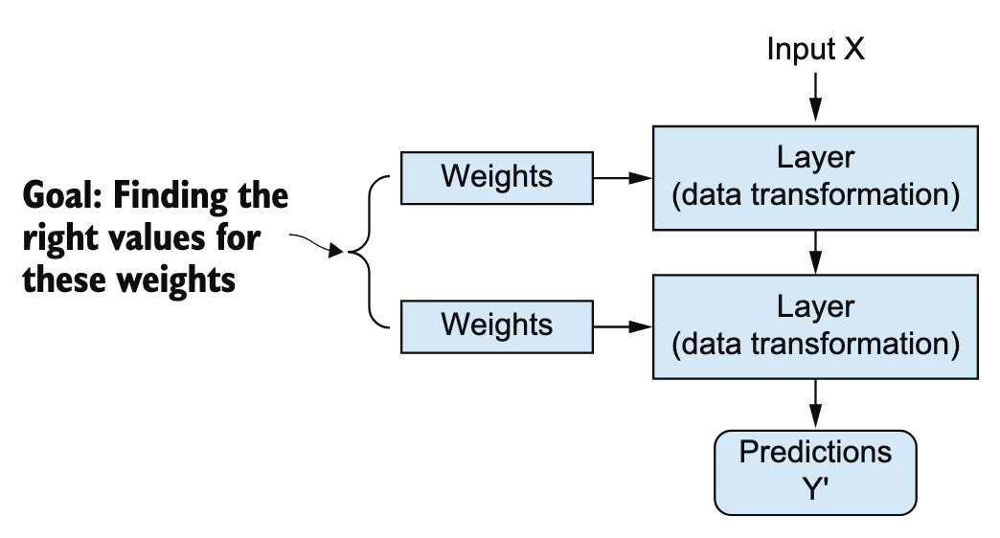
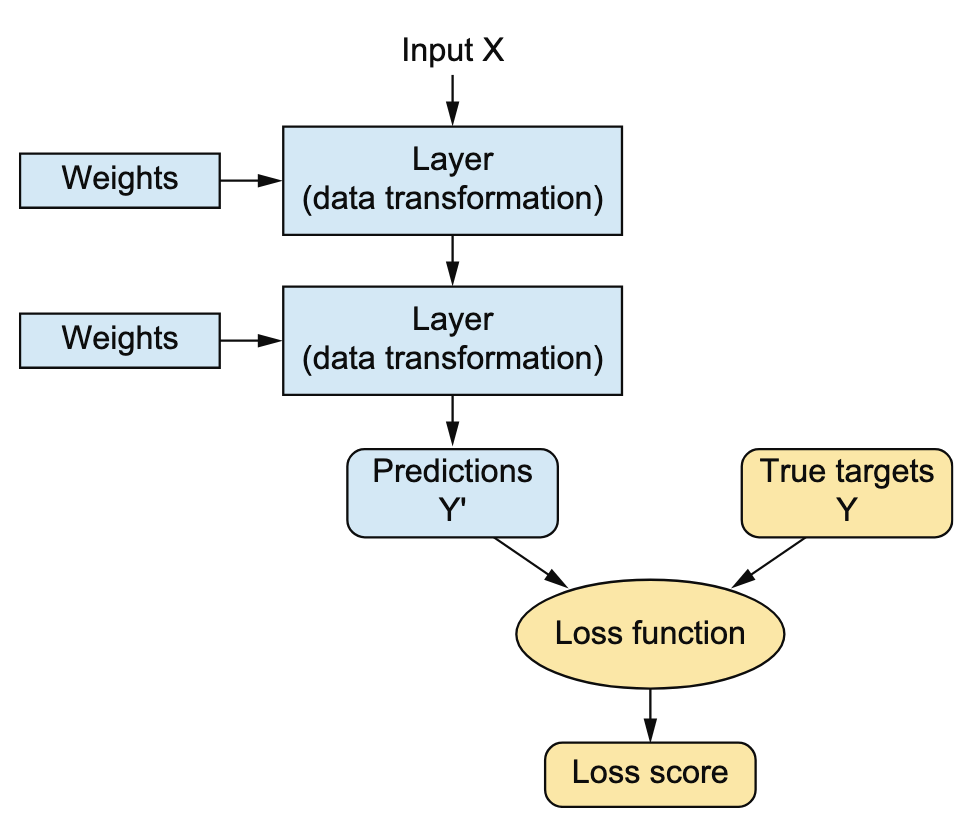
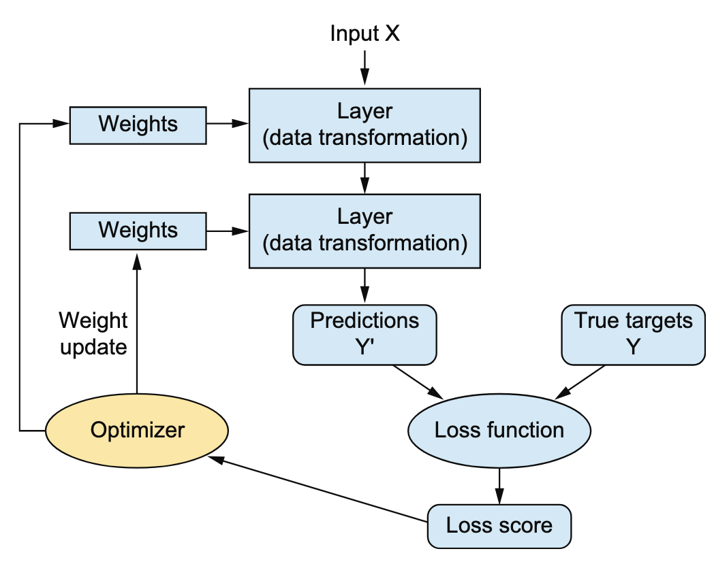

# DL Framework

## DL Overview

分层表示学习视角，是理解DL最经典、最直观的视角。《DL with Python, 3e》对深度学习有很精辟的解释。

### What is learning?

机器学习模型对数据进行变换，生成更加有用的表示。所谓有用，是使表示更接近期望的输出。

> A machine learning model transforms its input data into meaningful outputs, a process that is “learned” from exposure to known examples of inputs and outputs. Therefore, the central problem in machine learning and deep learning is to meaningfully transform data: in other words, to learn useful representations of the input data at hand—representations that get us closer to the expected output.

所谓学习，就是基于某种反馈信号，自动地在假设空间中搜索有效的变换和表示。

> Learning, in the context of machine learning, describes an automatic search process for data transformations that produce useful representations of some data, guided by some feedback signal—representations that are amenable to simpler rules solving the task at hand. Machine learning algorithms aren’t usually creative in finding these transformations; they’re merely searching through a predefined set of operations, called a hypothesis space.

> So that’s what machine learning is, concisely: searching for useful representations and rules over some input data, within a predefined space of possibilities, using guidance from a feedback signal.

### What is deep learning?

深度学习是机器学习的一种，所以深度学习本质上也是在学习表示。深度学习跟浅层学习的区别在于层数不同。浅层学习只学习1到2层，深度学习会学习很多层，数十甚至上百层。所以深度学习又被称为分层表示学习，或者层次表示学习。

> Deep learning is a specific subfield of machine learning; it’s a new take on learning representations from data, which emphasizes learning successive layers of increasingly meaningful representations. The “deep” in “deep learning” isn’t a reference to any kind of deeper understanding achieved by the approach; rather, it stands for this idea of successive layers of representations. How many layers contribute to a model of the data is called the depth of the model. Other appropriate names for the field could have been layered representations learning or hierarchical representations learning. Modern deep learning often involves tens or even hundreds of successive layers of representations, and they’re all learned automatically from exposure to training data. Meanwhile, other approaches to machine learning tend to focus on learning only one or two layers of representations of the data (say, taking a pixel histogram and then applying a classification rule); hence they’re sometimes called shallow learning.

深度学习模型被称为神经网络，是因为曾经受到脑神经科学的启发。但是现代深度学习模型和大脑并没有什么关系，理解神经网络不需要脑科学的知识。对我们来说，深度学习就是从数据学习表示的数学框架。

> In deep learning, these layered representations are learned via models called neural networks, structured in literal layers stacked on top of each other. The term neural network is a reference to neurobiology, but although some of the central concepts in deep learning were developed in part by drawing inspiration from our understanding of the brain (in particular, the visual cortex), deep learning models are not models of the brain. For our purposes, deep learning is a mathematical framework for learning representations from data.

### How deep learning works?

用3张图说明深度神经网络是如何工作的。

模型结构？

如何评估？loss function.

如何学习？通过optimizer实现backpropagation算法.

### 深度学习的数学基础

深度学习是从数据学习表示的数学框架，其数学基础主要是线性代数、微积分、概率和统计等。

* 线性代数用来表示数据和描述变换
* 微积分用来训练神经网络
* 概率和统计，用来处理不确定性和解释数据模式

### 深度学习引发AI革命的特点

深度学习之所以能引发AI革命，是因为其具有某些特点。多年以后，我们也许不再使用神经网络，但是那时我们所用的技术将直接继承自现代深度学习及其核心概念。这些特点可以概括为三类：简单、可扩展、通用。

> Deep learning has several properties that justify its status as an AI revolution, and it’s here to stay. We may not be using neural networks many decades from now, but whatever we use will directly inherit from modern deep learning and its core concepts. These important properties can be broadly sorted into three categories

消除了特征工程，使ML工作流大大简化：

> Simplicity. Deep learning makes problem solving much easier, because it automates what used to be the most crucial step in a machine learning workflow: feature engineering.

对算力和数据的扩展性：

> Scalability. Deep learning is highly amenable to parallelization on GPUs or more  specialized machine learning hardware, so it can take full advantage of Moore’s law. In addition, deep learning models are trained by iterating over small batches of data, allowing them to be trained on datasets of arbitrary size.

通用性，基础模型能迁移、定制、微调：

> Versatility and reusability. Unlike many prior machine learning approaches, deep learning models can be trained on additional data without restarting from scratch, making them viable for continuous online learning—an important property for very large production models. Furthermore, trained deep learning models are repurposable and thus reusable: this is the big idea behind “foundation models”—large models trained on humongous amounts of data, which can be used across many new tasks with little retraining, or even none at all.

成功的技术有其共性，失败的技术却各有各的问题。

## DL Framework Overview

深度学习的发展离不开软件框架的支撑，曾经百花齐放的局面已经渐渐收敛。

现在最流行的深度学习框架无疑是PyTorch，它是现代AI software stack的核心之一。

> TF was the leading deep learning library for many years, used internally by Google and therefore optimized for production at scale. But PyTorch has gradually taken the lead, owing to its simplicity, flexibility and openness: it now dominates research papers and open source projects, which means that most new models are available in PyTorch first. As a result, the industry has also gradually shifted toward PyTorch.

Google已经从TensorFlow转向JAX。

> In recent years, Google has reduced its investments in TensorFlow, and focused more on JAX, another excellent deep learning library with a great mix of qualities for both research and production. However, its adoption is still low compared to PyTorch.

关于深度学习框架的未来，Francois Chollet在《DL with Python, 3e》给出了3个洞见，值得细细品味.

> Looking back on this chaotic history, we can ask, What’s next? Will a new framework arise tomorrow? Will we switch to a new programming language or a new hardware platform? If you ask me, three things today are certain:

> * Python has won. Its machine learning and data science ecosystem simply has too much momentum at this point. There won’t be a brand new language to replace it—at least not in the next 15 years. （Python赢了）

> * We’re in a multiframework world. It’s a good idea for you to learn a little bit about each one. It’s highly possible that new frameworks will gain popularity in the future, in addition to them; Apple’s recently released MLX could be one such example. （依然是多框架共存）

> * New chips may certainly arise in the future, alongside NVIDIA’s GPUs and Google’s TPUs. For instance, AMD’s GPU line likely has bright days ahead. But any new such chip will have to work with the existing frameworks to gain traction. New hardware is unlikely to disrupt your workflows. （软硬件协同）

## PyTorch

### PyTorch为什么会赢

> PyTorch has gradually taken the lead, owing to its simplicity, flexibility and openness.

有人说，这只是表面原因。深层原因是，技术革命总是由学术界外溢到工业界的，相应的工具也是应先满足学术，再逐渐溢出到工业界。学术到工业的分水岭，不是2012年，也不是2017年，而是2022年。不论对错，这个说法引人深思。

### PyTorch是什么

TODO

## References

《DL with Python, 3e》

Deep Learning with Python, Third Edition. Francois Chollet, Matthew Watson. 2025. Francois Chollet是Keras作者。相比《HOMLP》和《MLWP》，这本书最有价值的不是具体技术，而是对AI和DL的深刻洞见。

《HOMLP》

Hands-On Machine Learning with Scikit-Learn and PyTorch: Concepts, Tools, and Techniques to Build Intelligent Systems. Aurélien Géron. 2025.

《MLWP》

Machine Learning with PyTorch and Scikit-Learn: Develop machine learning and deep learning models with Python. Sebastian Raschka, Yuxi (Hayden) Liu, Vahid Mirjalili. 2022.

《HOMLP》和《MLWP》都是关于ML和DL通识和实战的好书，《HOMLP》比《MLWP》内容更新，可以结合着看。两本书都是一半讲ML，一半讲DL，讲解DL时也捎带讲了LLM。不必从头到尾精读，可以根据需要侧重ML基础、DL基础还是LLM基础有选择地看。

《花书》

Deep Learning (Adaptive Computation and Machine Learning series). Ian Goodfellow, Yoshua Bengio, Aaron Courville. 2016. 俗称《花书》。DL的经典教材，第一章关于DL的概览、历史和本质，值得一读。关于DL的其他内容，看更新的《UDL》和《DLFC》更好。

《UDL》

Understanding Deep Learning. Simon J.D. Prince. 2023. 俗称《UDL》. DL的理论、数学。相比《DLFC》，《UDL》对工程师更友好。

《DLFC》

Deep Learning: Foundations and Concepts. Christopher Bishop, Hugh Bishop. 2023. 相比《UDL》，更偏理论。

《花书》、《UDL》、《DLFC》都是偏理论和数学的经典书，《UDL》和《DLFC》更新，被称为new bible。

《Math for ML》

Mathematics for Machine Learning. Marc Peter Deisenroth. 2020. 关于ML和DL数学的经典书籍，《UDL》和《DLFC》都推荐它。

《Math of ML》

Mathematics of Machine Learning: Master linear algebra, calculus, and probability for machine learning. Tivadar Danka. 2025. 相比《Math for ML》，本书从更加基础的内容讲起，学习曲线没有那么陡峭。

《Why Machines Learn》

Why Machines Learn: The Elegant Math Behind Modern AI. Anil Ananthaswamy. 2024.
